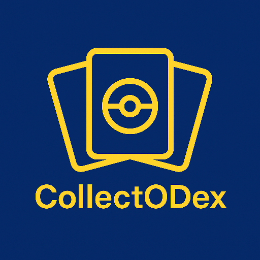
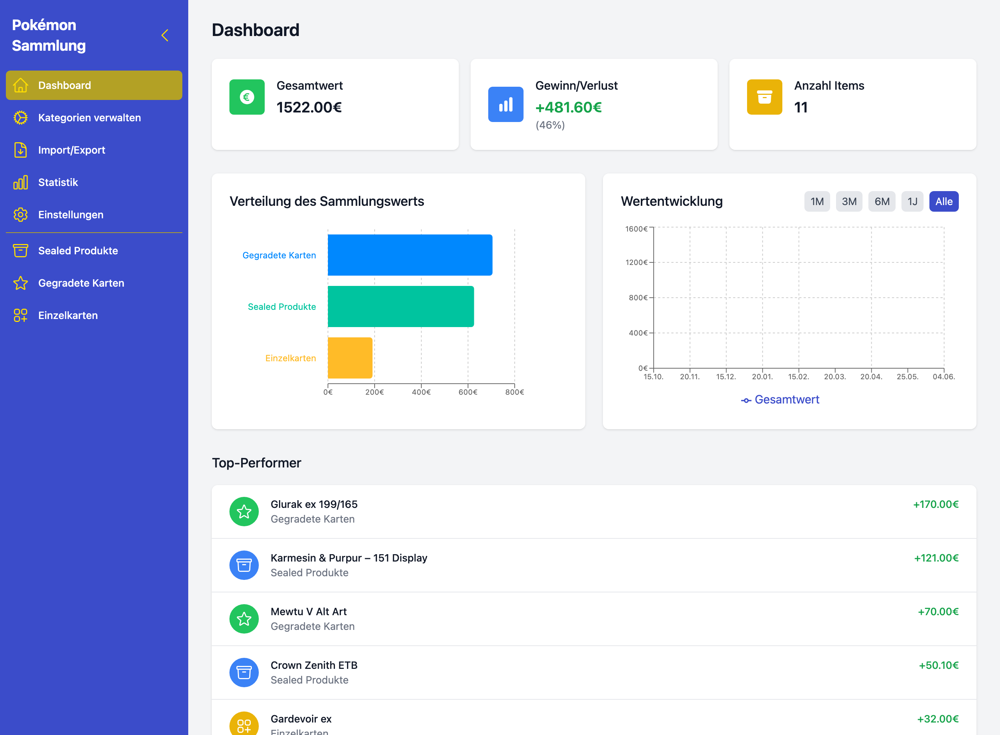
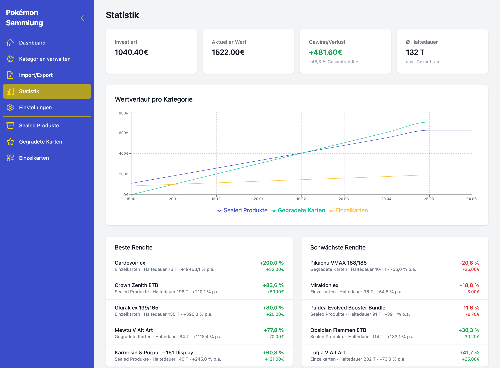
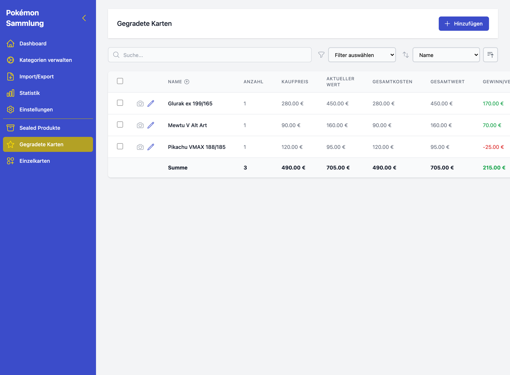
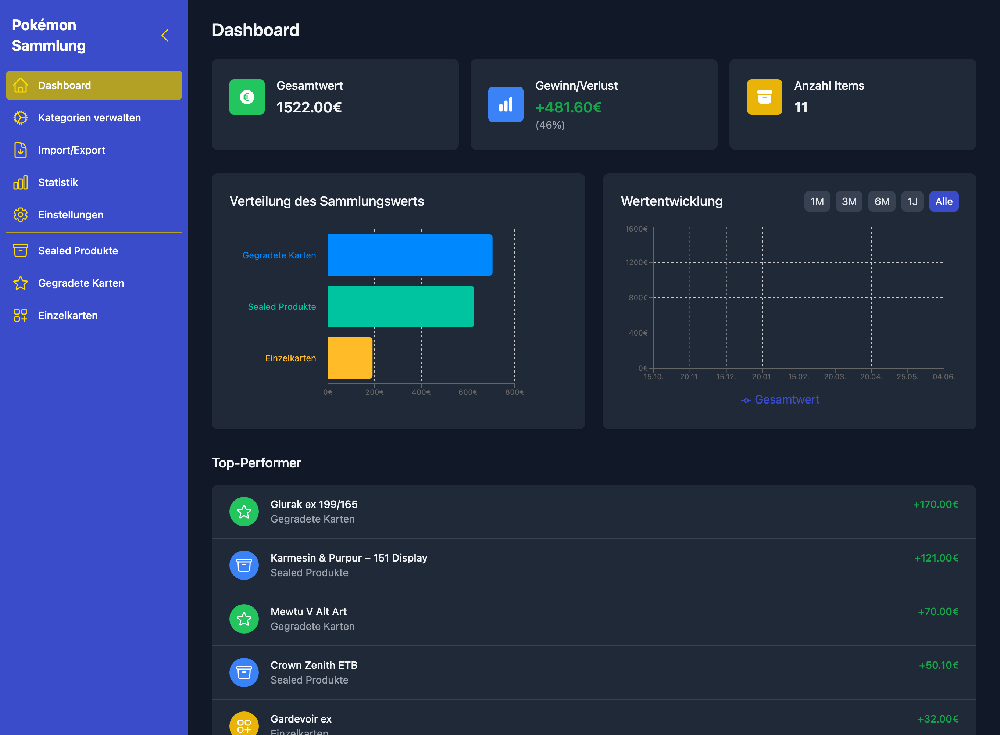
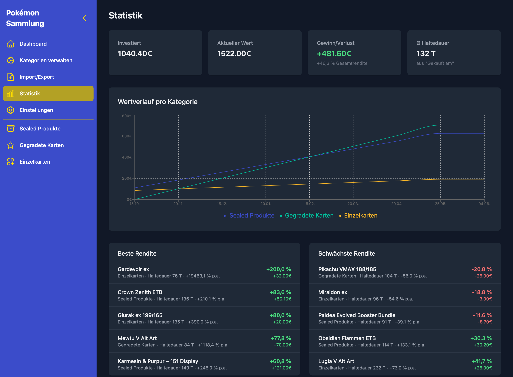
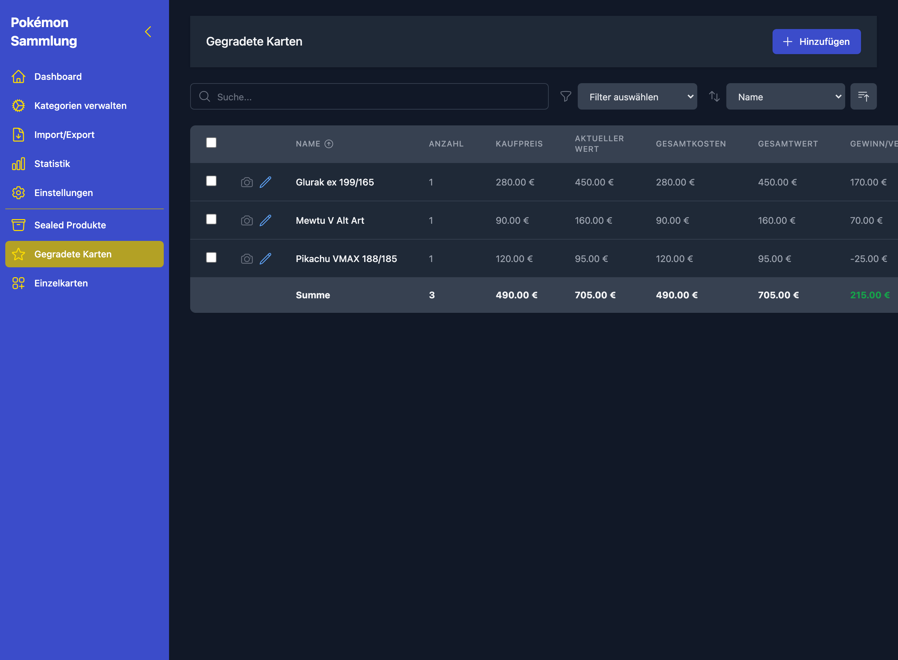

<div align="center">



# CollectODex

**Die Desktop-App für deine Pokémon-Kartensammlung.**
Kategorisieren, bewerten, Bestand führen – und sehen, was deine Sammlung wert ist.

🇩🇪 Deutsch · [🇬🇧 English](README.en.md)

[](https://github.com/R0cketBean/collectodex/releases/latest)
[](https://github.com/R0cketBean/collectodex/releases)
[](https://github.com/R0cketBean/collectodex/actions/workflows/build.yml)
[](LICENSE)


[**⬇️ Download**](https://github.com/R0cketBean/collectodex/releases/latest) · [Landingpage](https://r0cketbean.github.io/collectodex/) · [Roadmap](https://github.com/R0cketBean/collectodex/milestones)

</div>

---

<div align="center">
  
</div>

## Was ist CollectODex?

CollectODex ist eine lokale Desktop-Anwendung, mit der du deine Pokémon-Sammlung
strukturiert verwaltest – von Sealed-Produkten über gegradete Karten bis zu
Einzelkarten und beliebigen eigenen Kategorien. Alle Daten bleiben auf deinem
Rechner; nichts wird in eine Cloud hochgeladen.

## Funktionen

- 📦 **Flexible Kategorien** – Sealed, Gegradet, Einzelkarten oder eigene Kategorien mit frei definierbaren Attributen.
- 📊 **Dashboard** – Gesamtwert, Gewinn/Verlust, Wertverteilung und Wertentwicklung auf einen Blick.
- 📈 **Statistik** – Rendite je Position, durchschnittliche Haltedauer und Wertverlauf pro Kategorie.
- 🧮 **Berechnete Felder** – Gesamtkosten, Gesamtwert und Gewinn/Verlust per Formel automatisch ermittelt.
- 🌗 **Dark Mode** – Hell, dunkel oder dem System folgend.
- 🔎 **Suchen, Filtern & Sortieren** – auch auf dem schmalen Fenster.
- 💾 **Import/Export & automatische Backups** – Excel-Export und sicherbare Sicherungen.
- 🔄 **Auto-Update** – benachrichtigt über neue Versionen (electron-updater).

## Screenshots

| Dashboard | Statistik | Sammlung |
| :---: | :---: | :---: |
| [](docs/screenshots/dashboard-light.png) | [](docs/screenshots/statistics-light.png) | [](docs/screenshots/collection-light.png) |

<details>
<summary>🌙 Dark Mode</summary>

| Dashboard | Statistik | Sammlung |
| :---: | :---: | :---: |
| [](docs/screenshots/dashboard-dark.png) | [](docs/screenshots/statistics-dark.png) | [](docs/screenshots/collection-dark.png) |

</details>

## Download & Installation

Die fertigen Builds gibt es auf der **[Releases-Seite](https://github.com/R0cketBean/collectodex/releases/latest)**.

**macOS** (signiert & notarisiert)
1. Die `.dmg` öffnen.
2. CollectODex in den Ordner „Programme" ziehen.

**Windows** (NSIS-Installer, derzeit unsigniert)
1. Die `…Setup.exe` ausführen.
2. Falls SmartScreen warnt: „Weitere Informationen" → „Trotzdem ausführen".

> 💡 Eine Übersicht mit Direktdownloads findest du auch auf der [Landingpage](https://r0cketbean.github.io/collectodex/).

## Entwicklung

Voraussetzungen: **Node.js 18+** und **npm 9+**.

```bash
npm install
npm run electron-dev   # React-Dev-Server + Electron in einem Schritt
```

Optional als reine Web-Version (ohne Electron-Wrapper):

```bash
npm start
```

Tests:

```bash
npm test
```

## Build

```bash
npm run electron-pack       # macOS (DMG + ZIP)
npm run electron-pack-all   # macOS + Windows + Linux
```

Die Artefakte landen unter `dist/`. Signierte Release-Builds erzeugt der
[Release-Workflow](.github/workflows/release.yml) automatisch beim Pushen eines
`v*`-Tags.

> Die Screenshots in diesem README werden mit `node scripts/generate-screenshots.mjs`
> aus der laufenden Web-Version (`npm start`) reproduzierbar erzeugt.

## Architektur

| Pfad | Zweck |
| --- | --- |
| `src/types/models.ts` | Datenmodell: Kategorien definieren Attribute, Items speichern Werte je Attribut-ID – dadurch beliebige eigene Kategorien. |
| `src/context/CollectionContext.tsx` | Globaler Sammlungs-State (granulare Slices, stabile Actions). |
| `src/pages/` | Dashboard, Sammlungslisten, Kategorieverwaltung, Statistik, Import/Export, Einstellungen. |
| `src/services/StorageService.ts` | Persistenz-Abstraktion (Electron-Store ↔ `localStorage`-Fallback). |
| `public/electron.js`, `public/preload.js` | Electron-Hauptprozess und Preload. |

Stack: **React 19 · TypeScript · Tailwind CSS · Vite · Electron · Recharts**.

## Datenspeicherung

Sammlungs- und Kategoriedaten liegen im Electron-User-Data-Verzeichnis
(Schlüssel `pokemon_collection_categories`, `pokemon_collection_items`,
`pokemon_collection_value_history`). Im Browser dient `localStorage` als
Fallback.

## Roadmap

Die Planung läuft über [GitHub-Milestones](https://github.com/R0cketBean/collectodex/milestones).
Aktuelle Schwerpunkte: Konsolidierung & Performance, offizielle
Cardmarket-OAuth-API für Preise, Design-Feinschliff – Windows-Politur zuletzt.

## Lizenz

[MIT](LICENSE) © Andreas Bröder
